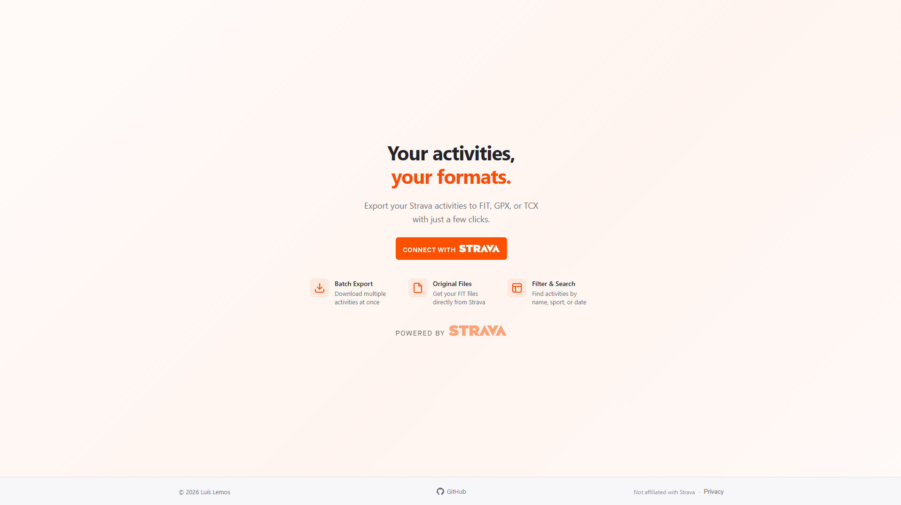
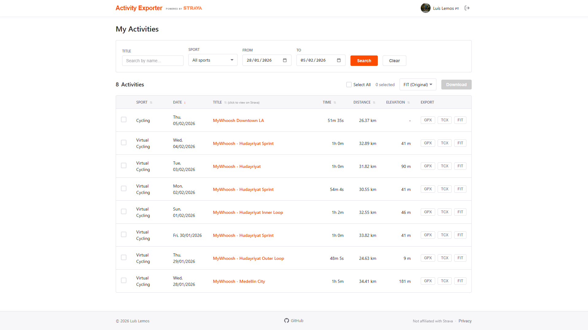

# 🚴 Strava Activity Exporter

A web application to export your Strava activities to **GPX**, **TCX**, or **FIT** formats. Export multiple activities at once, making it easy to import them into platforms that don't support direct Strava sync.





---

## 📱 Features

- 🔐 **Strava OAuth:**
   Secure authentication with your Strava account.
- 📋 **Activity Browser:**
   View all your activities with search, filters, and sorting.
- 📥 **Multiple Formats:**
   Export to FIT (original), GPX, or TCX.
- 📦 **Batch Export:**
   Download multiple activities at once as a ZIP file.
- 🎯 **Smart Filters:**
   Filter by sport type, date range, or activity name.

---

## ⚙️ Tech Stack

- **Backend:** Node.js, Express
- **Frontend:** Vanilla HTML, CSS, JavaScript
- **APIs:** Strava API v3
- **Libraries:** JSZip (client-side ZIP generation)

---

## 🚀 Getting Started

### 1. Clone the repository

```bash
git clone https://github.com/luisandrelemos/strava-activity-exporter.git
cd strava-activity-exporter
```

### 2. Create Strava API Application

1. Go to [Strava API Settings](https://www.strava.com/settings/api)
2. Create a new application:
   - **Application Name:** Any name
   - **Website:** `http://localhost:3000`
   - **Authorization Callback Domain:** `localhost`
3. Copy your **Client ID** and **Client Secret**

### 3. Configure Environment

```bash
cp .env.example .env
```

Edit `.env` with your credentials:

```
STRAVA_CLIENT_ID=your_client_id
STRAVA_CLIENT_SECRET=your_client_secret
```

### 4. Install and Run

```bash
npm install
npm start
```

Open [http://localhost:3000](http://localhost:3000) in your browser.

---

## 📂 Project Structure

```
/public
  /css            → stylesheets
  /js             → frontend JavaScript modules
  /img            → images and icons
server.js         → Express server with OAuth handling
```

---

## 📄 Export Formats

| Format | Description |
|--------|-------------|
| **FIT** | Original file from your device |
| **GPX** | GPS track with coordinates and elevation |
| **TCX** | Training data with heart rate, cadence, and power |

---

## ⚠️ Rate Limits

Strava API limits:
- 100 requests / 15 minutes
- 1000 requests / day

The app handles rate limiting automatically.

---

## 📄 License

MIT

---

> Made with ❤️ by Luís Lemos
